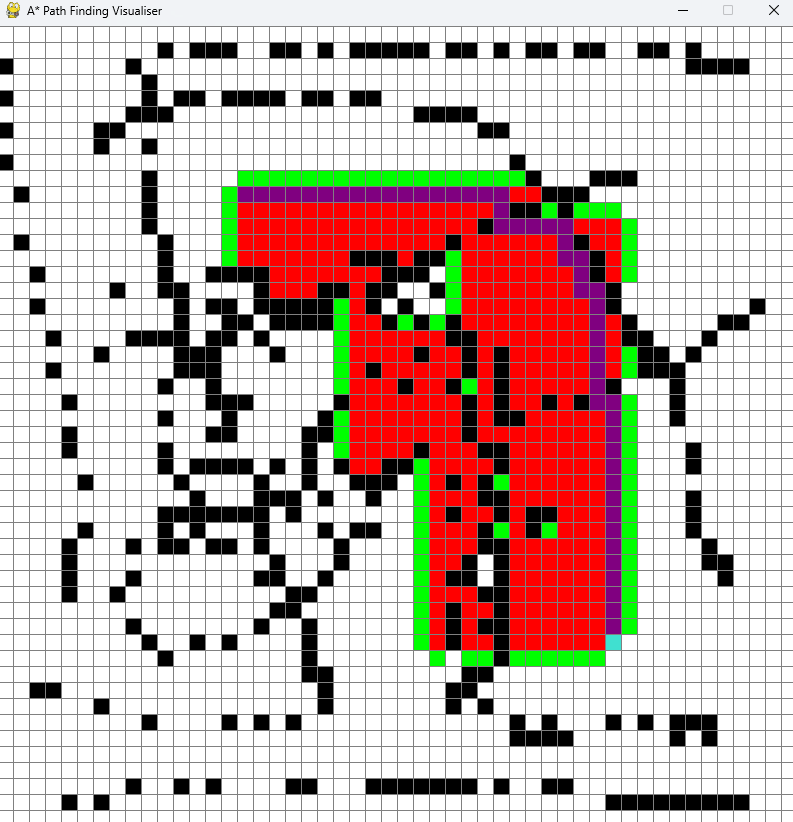
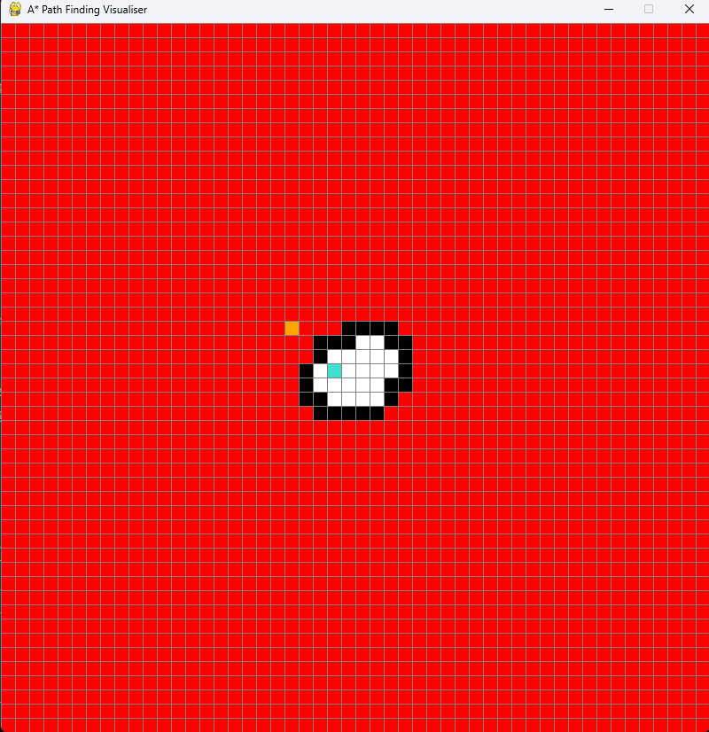

# A\* Pathfinding Visualizer

This project visualizes the A\* pathfinding algorithm. You can see how the algorithm efficiently finds the shortest path from a start node to a target node while avoiding obstacles. It also allows you to interactively modify the grid by adding or removing obstacles and changing the start and end points.

## Features

- **Interactive Grid**: Click to set start and end points, and drag to place barriers.
- **A\* Algorithm Visualization**: Visualize the step-by-step process of the A\* algorithm finding the shortest path.
- **Algorithm Controls**: Start, clear, and control the algorithm’s execution.

## Installation

To run the A\* visualizer locally, follow these steps:

1. **Clone the repository**:

```bash
git clone https://github.com/your-username/A-Visualiser.git
```

2. **Install dependencies**:

The only dependency of this project is `pygame`.

```bash
python -m venv venv      # Create virtual environment
source venv/bin/activate  # Activate virtual environment (Linux/Mac)
venv\Scripts\activate     # Activate virtual environment (Windows)
pip install -r requirements.txt  # Install dependencies
```

3. **Command**:

Use the following command to run the application:

`python astar.py`

This will open a grid of 50 by 50 block. This configuration can be change from the code in the `main` method's `ROWS` variable

### **Grid Setup**

- **Left-click**:
  - Set the **start node** (first click).
  - Set the **end node** (second click).
  - **Place obstacles**: Drag to place barriers (blocks).
- **Right-click**:
  - **Reset** a node (removes the start, end, or obstacle).

### **Algorithm Controls**

- **Spacebar (K_SPACE)**: Start the A\* algorithm if both **start** and **end** nodes are set.
  - The algorithm will begin exploring the grid to find the shortest path from the **start** node to the **end** node while avoiding obstacles.
- **C key (K_c)**: Clear the grid and reset the start, end, and obstacles.

### **Node & Grid Interaction**

- **Left mouse button**:
  - Place **start** and **end** nodes.
  - Add **barriers** by dragging the mouse.
- **Right mouse button**:
  - Remove nodes or obstacles (reset the grid).

### **Pathfinding Execution**

- **Start the A\* algorithm**: After setting the **start** and **end** nodes, press **space** to begin the algorithm. The algorithm will search for the shortest path.
- **Reset the grid**: Press **C** to clear the grid, reset the start and end nodes, and remove any obstacles.

### **Visual Effects**

- **Step-by-step exploration**: Visualize how A\* explores the grid and evaluates each node.

### **Path found**

<figure>
  
  <figcaption>Visual representation of the A* algorithm find path between barriers.</figcaption>
</figure>

### **Path not found**

<figure>
  
  <figcaption>Visual demonstration of no path between start and end spot</figcaption>
</figure>

The grid is highly configurable to other algorithms such as dijkstra algorithm and other path finding algorithms.
